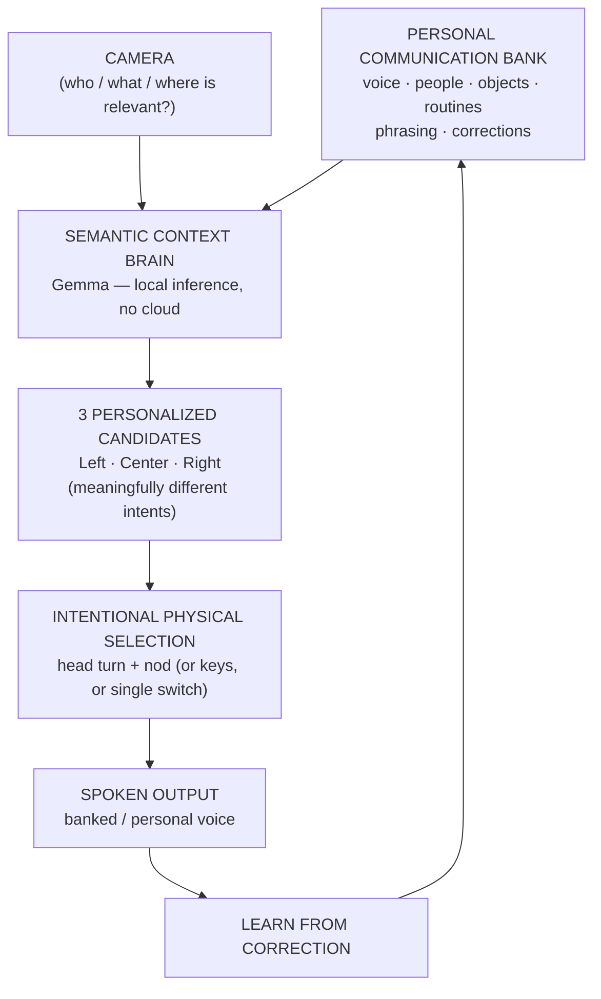

# NeurTalk

**An adaptive communication system for people losing speech and movement (e.g. ALS). It combines environmental context, a person's linguistic identity, and whatever reliable movement they still have — so they can say what *they* would say, in their own voice, with one head turn and a nod.**

Built solo in one day for **Build with Gemma NYC: On-Device AI for Healthcare** (Google DeepMind, Aug 1, 2026).

> **The environment supplies context. The personal bank supplies identity. The user supplies intent.**
>
> NeurTalk never speaks *for* the person. It reduces thousands of possible sentences to three highly relevant ones, so the user remains the final author. **Context proposes. The person disposes.**

---

## The problem

When ALS or similar conditions take away speech and hand control, today's AAC (augmentative & alternative communication) tools ask people to reconstruct every sentence letter-by-letter — roughly **40 painstaking selections** for one sentence, through whatever movement remains. Voice banking preserves what someone *sounds like*, but not how they phrase things, who matters to them, or their humor. People don't just lose their voice; they lose their *authorship*.

## What NeurTalk does

| Step | What happens | Powered by |
|---|---|---|
| 1. **Preserve** | Guided onboarding banks the person's voice (a counting sample), contextual audio (uploads or recordings, logged in an on-device audio bank), and the people who matter | on-device profile + IndexedDB audio bank; nothing leaves the machine |
| 2. **See** | A wearable camera reads the current scene — who's present, what objects are visible, what's happening. Smart glasses in the real product; for the demo, **your phone stands in**: scan a QR code and its rear camera streams to the interface peer-to-peer (WebRTC) | **Gemma (multimodal), running locally via Ollama** |
| 3. **Propose** | The context brain crosses the scene with the personal bank and generates exactly **3 intent-distinct candidate messages**, phrased the way this person actually talks | **Gemma, running locally** |
| 4. **Choose** | Head turn (left / center / right) highlights a candidate; a deliberate nod selects; a second confirmation speaks it | MediaPipe Face Landmarker, in-browser |
| 5. **Learn** | Edits and selections become explicit preferences ("grab" over "bring") that shape future candidates | correction history fed back into Gemma prompts |

**Effort metric — actions to express one message:**

| Method | Intentional actions required |
|---|---|
| Full keyboard | ~40 character selections |
| Predictive keyboard | ~15–25 selections |
| Semantic tile AAC | 3–5 selections |
| **NeurTalk** | **1 head direction + 1 nod** |

## Architecture



The selection layer is deliberately **decoupled from any one input**. Head pose, number keys, and single-switch scanning all reduce to the same two primitives — `highlight(slot)` + `confirm()` (`src/input/useSelection.ts`). ALS progression varies; the brain accepts whichever reliable movement remains.

## How Gemma is used (and why it must run on-device)

Gemma is the reasoning core, not a garnish — four distinct inference passes:

1. **Semantic mining** (`extractSemantics`): the user's real speech (uploads/recordings, transcribed on-device by in-browser Whisper) goes to Gemma, which extracts characteristic expression templates ("I want that damn ___"), style quirks, and people.
2. **Vision pass** (`describeScene`): a camera frame — from the phone-as-glasses stream when connected — returns structured JSON: people present, objects visible, location, activity. Raw imagery is never stored.
3. **Candidate generation** (`generateCandidates`): Gemma crosses the personal bank with the scene and returns exactly 3 *intent-distinct* candidates, re-filling mined templates from what it sees: "I want that damn ___" + a visible blue cup → "I want that damn blue cup".
4. **Preference learning** (`analyzeCorrection`): each user edit is analyzed by Gemma into an auditable preference ('"grab" over "bring"') and, when one exists, a new reusable expression template.

All inference runs through **Ollama on `localhost`** — a continuous camera feed of someone's home, family, and caregivers is among the most sensitive data streams imaginable. It cannot go to a cloud API. This is exactly the workload on-device Gemma exists for.

Head tracking also runs fully on-device: **MediaPipe Face Landmarker** (WASM/WebGPU, in-browser) estimates yaw (turn = choose) and pitch (nod = confirm), with per-person neutral calibration.

## Running it

**Hosted demo:** https://mjmgerdes.github.io/neurtalk/ — head tracking and the full UI run in-browser; the hosted page uses labeled demo candidates since your browser can't reach a local Ollama from a hosted origin by default. Run locally for full Gemma inference:

```bash
# 1. Local Gemma via Ollama
ollama pull gemma4           # primary; gemma3:4b also works as a fast fallback
ollama serve                 # if not already running

# 2. App
npm install
npm run dev                  # open http://localhost:5173, allow camera + mic
```

- Model is configurable without rebuild: `localStorage.setItem("neurtalk.model", "<model>")` in the console.
- **No Ollama?** The interaction demo still runs with clearly-labeled fallback candidates, so the access-method demo never blocks on inference.

### Demo walkthrough

1. **Onboard** — four steps: record a voice sample (count to 10), add audio context (upload MP3s/videos or record yourself — all logged in the audio bank), add your people, then scan the QR code with your phone so its camera becomes your "glasses".
2. **Talk** — point the phone (or laptop camera) at a scene, type what was just said to you ("Do you need anything?"), press **Read scene**.
3. Three candidates appear. **Turn your head** left/center/right to highlight, **nod** to select, nod again to speak.
4. **Edit** a candidate ("bring" → "grab") — watch *Preference learned* appear, and check the **Communication map** to see the bank grow.
5. Switch the access dropdown to **keys** or **single switch** — same brain, different body.

## Safety & scope (per hackathon rules)

- **Decision-support / accessibility only.** No diagnosis, no treatment, no clinical claims.
- **Urgent messages** ("I'm in pain") are fixed, user-approved buttons that **bypass generative inference entirely** — safety-critical communication is never left to a model.
- **Synthetic data only** — the demo profile (Sarah, the blue mug) is fictional.
- The user authors every utterance: nothing is spoken without deliberate, explicit confirmation.

## What's real vs. simulated in this prototype

Honesty section for judges:

- ✅ Real: local Gemma scene understanding + candidate generation, in-browser head-pose selection with calibration, correction learning loop, switch-scanning and keyboard access methods.
- 🟡 Partly real: the banked voice speaks through a best-available chain — ElevenLabs instant clone of the onboarding sample (optional; the one disclosed cloud component), macOS **Personal Voice** (trained on-device), or a system voice. Whisper transcription and Gemma semantic mining of uploaded audio are real; seed people/objects are demo data unless you add your own.
- 🔮 Product path: smart-glasses form factor, eye-gaze adapter, ongoing voice banking, SLP-shareable communication access reports.

## Repo map

```
src/
  llm/         Gemma client (Ollama, localhost) + prompt design
  input/       MediaPipe head tracker + access-method-agnostic selection core
  peer/        phone-as-glasses camera link (WebRTC; signaling only via PeerJS broker)
  speech/      voice output (Personal Voice aware)
  state/       personal communication bank + audio bank + history (all on-device)
  screens/     Onboarding wizard · Talk · Communication Map · History · PhoneCamera
```
